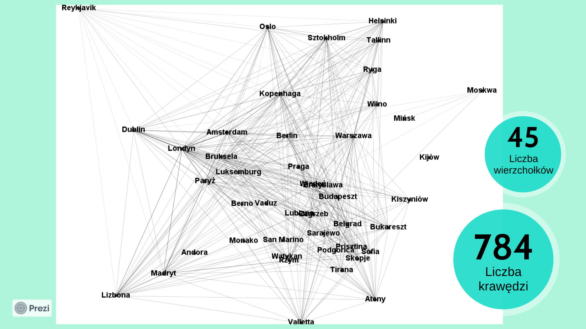

# Analiza-lotow 
Projekt grupowy z zakresu teorii grafów i sieci, dotyczący **analizy połączeń lotniczych** między stolicami europejskimi.

Celem pracy jest przedstawienie sposobów modelowania sieci lotów oraz analiza ich własności, takich jak spójność, centralność czy struktura połączeń.

Dane zostały zebrane ręcznie ze strony [flightradar24.com](https://flightradar24.com) (ostania aktualizacja danych 12.01.2024).

Analiza i wizualizacja grafu zostały wykonane w programie **Gephi**.

## Charakterystyka sieci

- **Wierzchołki** – stolice państw europejskich  
- **Krawędzie** – połączenia lotnicze między stolicami 
- **Graf skierowany** – kierunek krawędzi ma znaczenie (z miasta A do miasta B)  
- **Graf ważony** – wagi oznaczają liczbę lotów na danej trasie  
 

[Analiza lotow.pdf](./Analiza%20lotow.pdf) – prezentacja projektu

